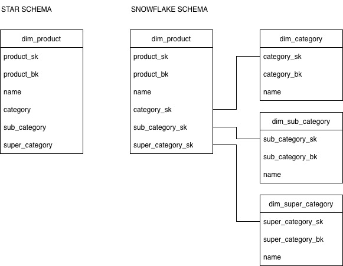

## Star Schema (one wide `dim_product`)

### Advantages

- **Simplicity of DML operations.**  
  `SELECT`, `INSERT`, and `UPDATE` statements are straightforward – all attributes are in one table, so no complex joins or multi-table coordination is required.

- **Fewer joins = faster queries.**  
  Analytical queries involving category, subcategory, or supercategory directly hit a single wide table, avoiding the overhead of multiple joins. This translates into faster dashboard performance.

- **Quick understanding for end users.**  
  Business analysts and BI tools see a flat table with all descriptive columns. They don’t need to learn a relational chain of tables, which lowers the barrier to self-service analytics.

### Disadvantages

- **Cost of updating hierarchies.**  
  When a category, subcategory, or supercategory name (or the hierarchical relationship itself) changes, you must update a large number of rows. You either keep only the current name and lose history (SCD Type 1), or maintain both old and new names in the same row, leading to duplication and confusion.

- **SCD Type 2 becomes heavy.**  
  If full historical tracking is required, every hierarchy change forces a new version for every affected product, exploding the number of rows in the dimension. This adds storage overhead and slows down ETL processes.

### When to choose Star Schema

- The primary goal is **fast, easy-to-consume reports** for business users who are not SQL experts.
- The category hierarchy is **relatively stable** – changes are rare (e.g., once a year or less).

In other words, if simplicity and query speed outweigh the need for flexible hierarchy management, the Star Schema is the right choice.

## Snowflake Schema (three related tables)

### Advantages

- **Single source of truth for hierarchy nodes.**  
  Each category, subcategory, and supercategory is stored only once in its own table. This eliminates redundancy, ensures consistent naming, and makes maintenance straightforward — a change to a category name is a single-row update.

- **Flexibility in updating hierarchies.**  
  Because hierarchy levels are independent tables, reorganizations (e.g., moving a subcategory to a different parent category) require minimal changes. You can apply SCD Type 2 to the hierarchy tables separately without duplicating all product rows, which is far more efficient and preserves full historical accuracy.

### Disadvantages

- **More complex queries.**  
  Any analytical query that needs attributes from multiple hierarchy levels must traverse several joins (fact → product → subcategory → category → supercategory). This increases SQL complexity and can slow down ad-hoc analysis.

- **Steeper learning curve.**  
  The schema is not self-explanatory at first glance. Users must understand the relational chain to build correct queries, which raises the barrier for non-technical stakeholders and BI tools that expect a simple flat view.

### When to choose Snowflake Schema

- **The hierarchy changes frequently** (e.g., every quarter) and **historical accuracy is a must**. Snowflake allows you to track changes at the right granularity without exploding the product dimension.
- **Strong consistency is required** across the organization — a single, governed set of hierarchy tables ensures that all reports use the same definitions.
- **One core model serves many different reports and dashboards.** A normalized foundation is easier to extend and reuse when multiple analytical products consume the same data but need different aggregations or perspectives.
